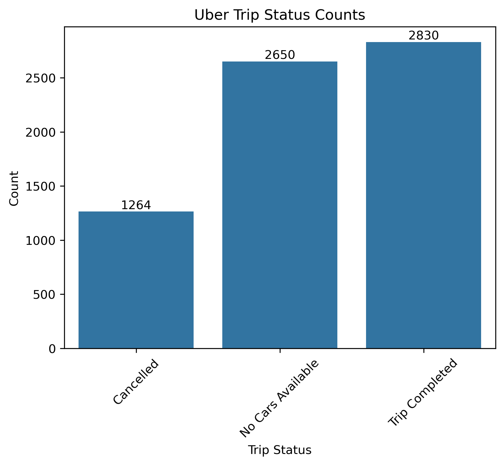

# G360 Rides — Supply-Demand Gap Analysis

Data Analytics project analyzing the supply-demand gap in a transportation network using Python and Excel.

## Project Overview

This project analyzes the supply-demand gap in a transportation network by examining ride requests, trip completion, cancellations, and vehicle availability across different pickup points and time periods.

The analysis focuses on identifying patterns in demand and supply, understanding where and when requests are not fulfilled, and translating the findings into actionable business recommendations.

The project uses Python and Excel to perform data preparation, exploratory data analysis, statistical analysis, and data visualization.

## Key Objectives

- Analyze ride-request patterns across pickup points and time periods.
- Examine trip completion, cancellations, and vehicle availability.
- Identify periods and locations where demand is not adequately matched by supply.
- Use data analysis and visualization to uncover operational patterns.
- Translate the findings into practical recommendations for improving resource allocation and operational efficiency.

## Tools & Technologies

- **Python** — Data preparation, exploratory data analysis, statistical analysis, and visualization
- **Pandas** — Data manipulation and analysis
- **Matplotlib** — Data visualization
- **Seaborn** — Statistical visualizations
- **Microsoft Excel** — Data analysis, pivot tables, charts, and statistical analysis
- **Jupyter Notebook** — Python-based analysis and documentation

## Dataset & Analysis Scope

The analysis uses ride-request data containing information on:

- Request ID
- Pickup Point
- Status
- Trip Status
- Timestamp

The analysis examines ride demand, trip outcomes, cancellations, vehicle availability, pickup-point patterns, and time-based variations to understand where supply does not adequately meet demand.

## Analysis Workflow

1. **Data Preparation** — Load and inspect the ride-request data.
2. **Data Cleaning** — Check data quality, data types, missing values, and prepare the timestamp field.
3. **Feature Preparation** — Derive time-period information from the timestamp.
4. **Exploratory Data Analysis** — Examine ride status, pickup points, and time-based patterns.
5. **Comparative Analysis** — Compare demand and trip outcomes across locations and periods.
6. **Statistical Analysis** — Apply statistical techniques to investigate patterns in the data.
7. **Visualization** — Present key patterns using charts and analytical visuals.
8. **Business Interpretation** — Translate analytical findings into operational recommendations.
   
## Key Findings

The analysis identified a significant mismatch between ride demand and completed trips, with the gap varying by pickup location and time period.

Key patterns observed include:

- High levels of unfulfilled ride requests due to vehicle unavailability and driver cancellations.
- Different supply-demand patterns between Airport and City pickup points.
- Time-of-day effects on cancellations and vehicle availability.
- Morning demand pressure at the City pickup point.
- Evening supply pressure at the Airport pickup point.

### Trip Status Distribution

## Business Recommendations

Based on the analysis, the following actions can help address the identified supply-demand imbalance:

- Increase driver availability during high-demand periods.
- Introduce targeted driver incentives during peak-demand windows.
- Improve vehicle availability at the Airport during evening periods.
- Strengthen driver availability around the City during morning periods.
- Monitor cancellations and vehicle availability by location and time period.
- Use demand patterns to support more effective resource allocation.

## Limitations

- The analysis is based on the available ride-request data and its recorded fields.
- The dataset does not provide all possible operational factors that could influence supply and demand.
- The findings describe patterns in the available data and should be validated with additional operational data before making major business decisions.

## Future Improvements

- Incorporate additional operational and contextual variables.
- Develop more detailed time-based demand forecasting.
- Build an interactive dashboard for ongoing monitoring.
- Evaluate the impact of driver incentives and resource-allocation strategies using additional data.

## Skills Demonstrated

- Python for data analysis
- Pandas for data manipulation
- Exploratory Data Analysis (EDA)
- Data cleaning and preparation
- Data visualization
- Statistical analysis
- Microsoft Excel analysis
- Business problem solving
- Insight generation and interpretation
- Data-driven recommendation development
